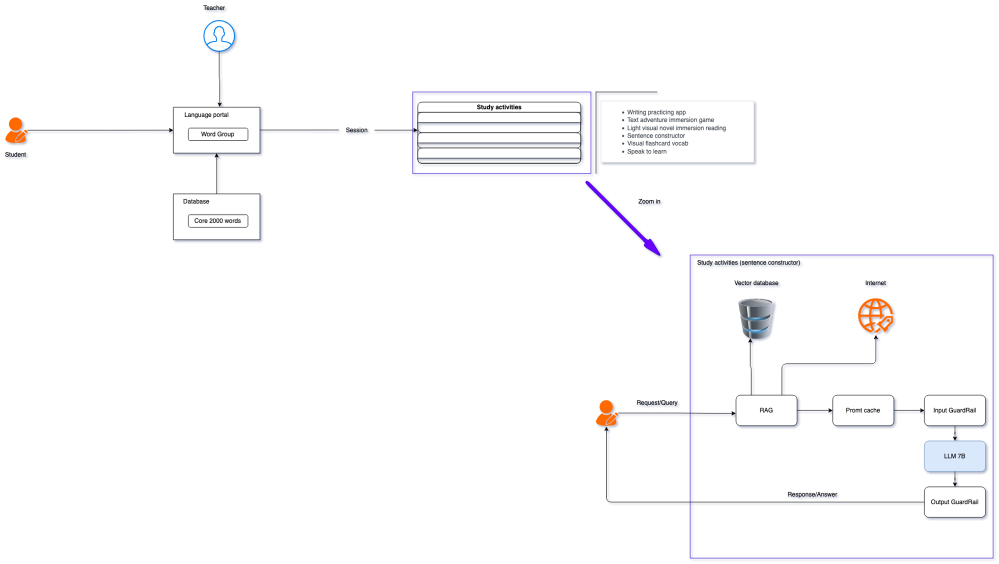

# Technical Considerations
---
Let’s assume we are following the three levels of diagramming:

## 1. Conceptual
- a high level diagram that is used to communicate to key stakeholders the business solution we are implementing.

## 2. Logical 
- a mid level diagram that describes the key technical components but not requiring detailed parameters so we can quickly rearchitect and communicate to our technical team the current workload.

## 3. Physical 

- a low level diagram that details all possible parameters and connections used by engineers/developers to accurately implement a solution (e.g. ARNs for resources, IP addresses, etc).
---

# Architectural/Design Considerations for GEN AI Web Application

This document outlines the architectural and design considerations for building a GEN AI web application aimed at augmenting the learning experience at a Japanese language learning school. It covers requirements, risks, assumptions, constraints, data strategy, model selection, infrastructure design, and more.

## 1. Requirements, Risks, Assumptions, & Constraints

### 1.1 Requirements

#### Business Requirements
- **Objectives & Outcomes:**
    - Enhance the learning experience for Japanese language students through personalized, AI-driven content.
    - Increase student engagement and retention via interactive, real-time feedback.
    - Support the school’s branding by delivering a modern, innovative educational solution.
- **Stakeholder Expectations:**
    - Timely delivery of a reliable system addressing privacy concerns.
    - A cost-effective solution aligned with the school’s infrastructure ownership strategy.

#### Functional Requirements
- **Core Capabilities:**
    - AI-powered recommendations and feedback based on user input.
    - Interactive sessions including quizzes, conversation simulations, and real-time corrections.
    - User management, content delivery, and progress tracking.
- **Interactivity and Integration:**
    - API endpoints for integrating AI capabilities with existing learning management systems.
    - Scalability across various content modules (e.g., vocabulary, grammar, cultural context).

#### Non-functional Requirements
- **Performance:**
    - Fast response times for real-time interactions.
    - Efficient handling of concurrent user requests.
- **Scalability:**
    - Infrastructure that adapts to a growing number of users or increased content complexity.
- **Security & Privacy:**
    - Secure handling of user data with encryption and strict access controls.
- **Usability:**
    - Intuitive user interface with accessibility features to cater to diverse learning needs.

#### Tooling: GenAI vs. ML
- **GenAI Tools:**
    - Evaluate general-purpose AI generators for natural language generation.
- **ML Pipelines:**
    - Establish a toolchain for data ingestion, model training, and real-time inference.

---

### 1.2 Risks
- **Model Performance & Reliability:**
    - The selected open-source LLM (e.g., IBM Granite) may not meet production performance expectations.
- **Data Privacy & Copyright:**
    - Training data must be legally compliant to avoid copyright issues.
- **Infrastructure Constraints:**
    - A limited hardware budget (10-15K) may impact scalability and performance.
- **Integration Challenges:**
    - Integrating AI capabilities with legacy educational systems may introduce unforeseen technical challenges.
- **Maintenance Overhead:**
    - The system may require ongoing monitoring and tuning beyond a “set and forget” approach.

---

### 1.3 Assumptions
- **Model Suitability:**
    - The chosen open-source LLM (e.g., IBM Granite) is assumed to be powerful enough for the budgeted hardware.
- **Network Bandwidth:**
    - A single server’s internet connection is assumed to support up to 300 concurrent users.
- **Data Integrity:**
    - Purchased educational content and supplementary data will be of high quality and legally compliant.
- **User Behavior:**
    - Usage patterns are based on current student activity, with additional planning for peak demand periods.

---

### 1.4 Constraints
- **Budget Constraints:**
    - Hardware investment is capped at 10-15K.
- **Geographical Constraints:**
    - Students are primarily located in Nagasaki, affecting latency and local support.
- **Regulatory & Copyright:**
    - Strict adherence to copyright laws mandates purchased or verified training data.
- **Technological Lock-in:**
    - Avoid dependency on single vendors by using open-source solutions and modular architectures.

---

## 2. Data Strategy

### Data Collection & Preparation
- **Source Identification:**
    - Define data sources (purchased content, user-generated data, supplemental materials).
- **Preprocessing Pipelines:**
    - Establish automated processes for data cleaning, normalization, and annotation.
- **Data Enrichment:**
    - Integrate metadata (e.g., difficulty levels, cultural notes) to enhance model context.

### Data Quality & Diversity
- **Diversity:**
    - Ensure the dataset covers a broad range of language scenarios and cultural contexts.
- **Quality Assurance:**
    - Regular audits and updates to maintain high data quality.

### Privacy & Security
- **Compliance:**
    - Adhere to data protection regulations with encryption for data at rest and in transit.
- **Access Controls:**
    - Implement strict role-based access and logging.

### Integration with Existing Systems
- **Seamless Data Flow:**
    - Ensure API compatibility with legacy systems.
- **Interoperability:**
    - Use standardized data formats (e.g., JSON, XML).

---

## 3. Model Selection and Development

### Model Choice Considerations
- **Self-Hosted vs. SaaS:**
    - Prefer self-hosted solutions (e.g., IBM Granite) for enhanced privacy and cost control.
- **Open Weight vs. Open Source:**
    - Evaluate trade-offs between completely open models and those with proprietary restrictions.
- **Input-Output Modality:**
    - Determine if the model operates as text-to-text or supports multi-modal inputs (e.g., audio).
- **Scalability:**
    - Assess the number of models, call frequency, and model size against infrastructure capabilities.

### Evaluation and Fine-Tuning
- **Context Window:**
    - Verify that the model’s context window aligns with content complexity.
- **Performance Metrics:**
    - Define KPIs such as latency, accuracy, and relevance.
- **Fine-Tuning:**
    - Identify areas for model fine-tuning to cater to Japanese language learning specifics.

---

## 4. Infrastructure Design

### Scalability and Flexibility
- **Cloud Platforms:**
    - Leverage cloud platforms for scaling and accessing specialized hardware (e.g., GPUs).
- **Modular Architecture:**
    - Adopt a modular design to allow for easy component replacement or upgrades.
- **Hybrid/Multi-cloud:**
    - Consider hybrid solutions combining on-premise privacy with cloud burst capacity.

### Integration and Deployment
- **APIs & Interfaces:**
    - Develop standardized APIs for easy integration with other systems.
- **CI/CD Pipelines:**
    - Implement continuous integration/continuous deployment for seamless updates.
- **Legacy Compatibility:**
    - Ensure new components communicate effectively with existing educational platforms.

---

## 5. Monitoring and Optimization

### Logging and Telemetry
- **Real-Time Monitoring:**
    - Set up systems to monitor model performance, usage metrics, and overall system health.
- **Feedback Loops:**
    - Use user feedback and system logs for continuous improvement.

### KPIs and Cost Monitoring
- **Performance Metrics:**
    - Track KPIs such as response time, error rates, and user engagement.
- **Billing Alerts:**
    - Configure alerts to monitor resource usage and keep costs within budget.

---

## 6. Governance and Security

### Responsible AI Policies
- **Ethical Guidelines:**
    - Develop policies for responsible AI usage, content moderation, and bias reduction.
- **Access Control:**
    - Implement stringent access controls and data protection measures.

### Regulatory Compliance
- **Standards & Audits:**
    - Ensure compliance with local/international regulations (e.g., GDPR).
- **Security Audits:**
    - Conduct periodic security assessments to identify and address vulnerabilities.

---

## 7. Scalability and Future-Proofing

### Containerization & Microservices
- **Flexible Deployments:**
    - Use container technologies (e.g., Docker, Kubernetes) for agile and isolated service deployment.
- **Component Isolation:**
    - Deploy microservices to allow independent updates without affecting the entire system.

### Version Control and Upgrades
- **Model & Data Versioning:**
    - Track changes in models and datasets to enable rollbacks if necessary.
- **Future Enhancements:**
    - Plan for integration with advanced AI models or additional features as technology evolves.

---

## 8. Business Considerations

### Use Cases
- **Definition & Clarity:**
    - Define GenAI use cases: personalized lesson plans, real-time language correction, interactive conversation simulations.
- **Complexity & Integration:**
    - Break down the system’s components (data pipelines, model inference, user interaction) for stakeholder clarity.
- **Operational Overhead:**
    - Assess if the system will be automated or require ongoing monitoring.

### Cost Levers
- **Key Cost Drivers:**
    - Hardware (server size, GPU requirements) and model training/inference costs.
- **Cost Optimization:**
    - Outline strategies for efficient resource usage and scaling based on demand.

### Vendor Lock-In and Flexibility
- **Avoiding Lock-In:**
    - Build with open standards and modular architectures to enable vendor or model transitions.
- **Interoperability:**
    - Favor open-source solutions and interoperable APIs.

### Essential Production Components
- **Guardrails & Evaluations:**
    - Define input/output guardrails and sandbox environments for testing new model versions.

---

## 9. LLM-Specific Considerations

### 9.1 Choosing a Model
- **Input-Output Modalities:**
    - Decide between text-to-text or multi-modal functionalities.
- **Open Source vs. Proprietary:**
    - Evaluate based on privacy, traceability, and performance (e.g., IBM Granite).
- **SaaS vs. Self-Hosted:**
    - Prefer self-hosting given privacy and cost considerations.
- **Context Window & Cost:**
    - Ensure the model’s context window meets the content requirements and aligns with cost constraints.

### 9.2 Enhancing Context
- **Context Injection vs. Knowledge Base:**
    - Decide whether to embed contextual data directly in the input or to reference a dynamic knowledge base.
- **Evaluation Criteria:**
    - Consider input size (entire document vs. chunks), frequency of use, and scalability needs for both prototyping and production.

### 9.3 Guardrails
- **Input Guardrails:**
    - Develop validation mechanisms to avoid unintended inputs.
- **Output Guardrails:**
    - Implement filters and post-processing to ensure outputs meet ethical and quality standards.
- **Implementation:**
    - Integrate guardrails at both the API and application logic levels.

### 9.4 Abstract Model Access
- **Unified Interface:**
    - Create an abstraction layer to standardize access to different models.
- **Supported Modalities:**
    - Ensure the interface supports current and future modalities (e.g., text, audio, image).

### 9.5 Caches
- **Caching Strategy:**
    - Define multi-level caching (request-level, model response-level) to improve performance.
- **Invalidation Rules & Storage:**
    - Document when caches should be invalidated and select storage options that balance speed and cost.
- **Hit Rate Optimization:**
    - Monitor and optimize cache hit rates.

### 9.6 Agents
- **Role and Integration:**
    - Outline the functions of any autonomous agents that act on model outputs.
- **System Integration:**
    - Ensure agents trigger workflows or notifications seamlessly.

---

## 10. Functional Requirements & Specific Use Case Considerations

- **Infrastructure Ownership:**
    - The organization prefers owning its infrastructure to address privacy concerns and manage long-term costs.
- **Budget and Scale:**
    - With an AI PC investment of 10-15K and 300 active students, optimize hardware for maximum throughput.
- **Local Network & Internet Connectivity:**
    - Confirm that the single server’s internet connection is robust enough for the projected load in Nagasaki.
- **Data and Model Choices:**
    - Use models like [IBM Granite](https://huggingface.co/ibm-granite) that offer traceability to address copyright concerns.
- **Assumptions Recap:**
    - Open-source LLMs will perform adequately on the allocated hardware.
    - A single server with sufficient bandwidth will support the user base.
    - Copyrighted materials will be managed through purchased, legally compliant content.

---

*This document is a living guide and should be updated as the project evolves or new requirements emerge.*
